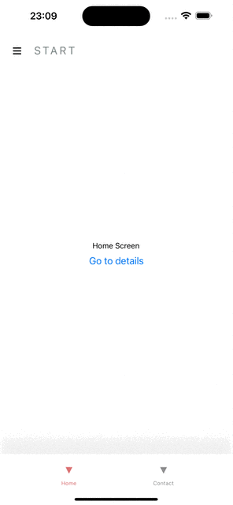

# GeraldTechChallenge

Welcome to the GeraldTechChallenge repository! This repository contains the solution for the technical challenge provided by Gerald Inc. It showcases my approach, implementation, and documentation for the challenge.

## Tech Stack

    React
    React-navigation
    React-native
    React-native-reanimated
    Styled-components
    Typescript
    jest

## Solution Overview

In this repository, you will find the following key components and files:

- `src/`: This directory contains the source code for the solution.
- `tests/`: This directory contains the unit tests for the solution.
- `docs/`: This directory contains the documentation files related to the solution.
- `README.md`: The main documentation file you are currently reading.

## Getting Started

To get started with the GeraldTechChallenge, please follow these steps:

1. Clone the repository:

   ```bash
   git clone https://github.com/RaiVolt/GeraldTechChallenge.git

   ```

2. Install the necessary dependencies.

   ```bash
   yarn i

   ```

3. Install ios dependencies.

   ```bash
   cd ios && pod install

   ```

4. Run Metro server
   ```bash
   yarn start

   ```
5. Run app on IOS or Android
   ```bash
    yarn ios or yarn android
   ```

## Animated GIF


